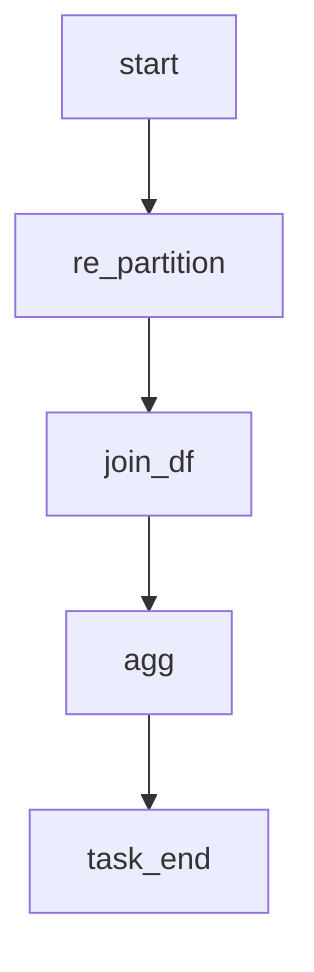

# spark_flow

### Airflow DAG flow



### USE
```python
re_task = PythonVirtualenvOperator(
    task_id='re.partition',
    python_callable=re_partition,
    system_site_packages=False,
    requirements=["git+https://github.com/dMario24/spark_flow.git@0.2.0/airflowdag"],
)
``` 

```bash
$ pip install git+https://github.com/dMario24/spark_flow.git@0.2.0/airflowdag
```